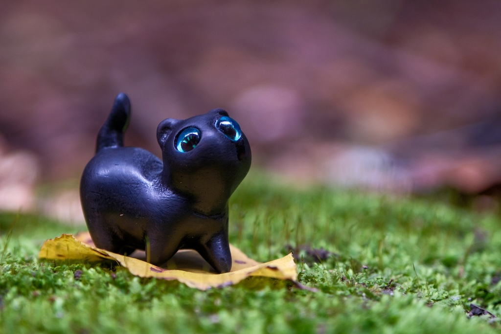
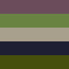
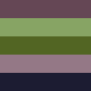
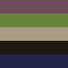

# Dominant-Colors

This a small library, with no external dependencies, which only purpose is to extract dominant colors from the image.
It uses K-Means algorithm to select K colors from the image.

The closest colors are calculated using L*a*b* color space, so the similarity is closer to what humans perceive as opposed
to RGB, where the similarity just means that numeric values for channel are close.

## Usage

Add the dependency on the library.

```shell
go get github.com/uaraven/dcolors
```

Use it to extract colors.

```go
import "github.com/uaraven/dcolors"

...

imageFile, err := os.Open("picture.jpg")
...
img, _, err := image.Decode(imageFile)

dColorsOptions := Options{
    InitialSelection: dcolors.RandomSelection,
    ExactMatch: true
}
colors := ExtractDominantColors(img, 4, &dColorOptions);
for _, c := range colors {
    fmt.Println(c.Hex())
}

```

## Options

Options chosen for color extraction will have great impact on what colors are extracted.

The following examples vary two parameters: `InitialSelection` and `ExactMatch`


|      Image       | Random seed, similar colors  | Random seed, exact colors | Uniform seed, similar colors  | Uniform seed, exact colors |
|:----------------:|:----------------------------:|:-------------------------:|:-----------------------------:|:--------------------------:|
|  |  |  |  |  |


## License

This library is licensed under the terms of MIT license.

Some code is taken from [Go-colorful](https://github.com/lucasb-eyer/go-colorful) project which is also distributed
under MIT license.